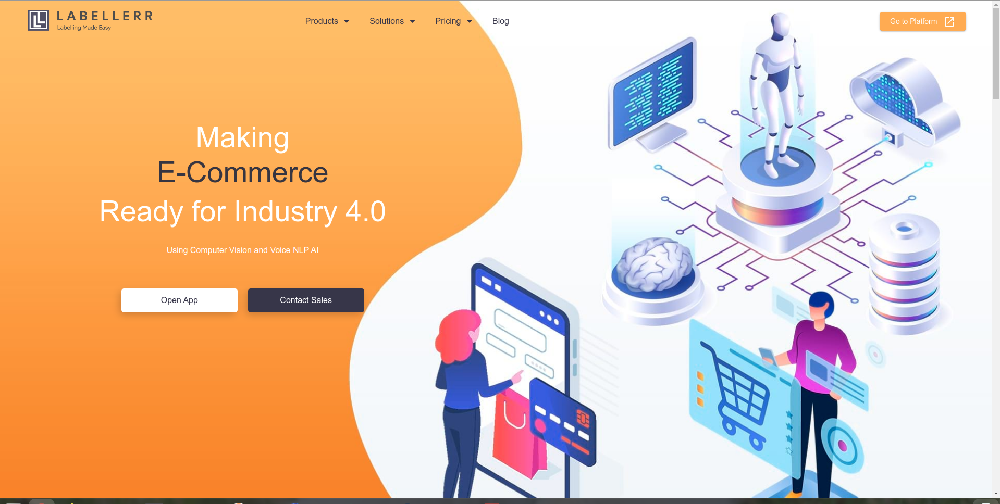

# Deep Learning
---

## Welcome to the public Repository of Labellerr

Labellerr is a One Stop Automated AI training and Data Annotation SAAS platform for Computer Vision, Voice and NLP solutions. Our goal is to provide organizations a tool so that they can focus more on building AI models quickly rather than waiting on any third party services. Specially designed for machine learning researchers, AI software developers, big data engineers & data scientists whose need is to label millions & billions of datasets in a shorter duration with minimal effort. With Labellerr you can annotate data in any form such as image, text, audio files, video, documents, geospatial, MRI etc by first converting it from unstructured/semi-structured to structured format. 

Visit our [website](https://www.labellerr.com/) to know more...

## Our Community Service Initiative

This repository is a part of our community service initiative, wherein we will be listing the implementations and walkthrough guides of tools, technologies, state of the art algorithms catering to the latest developments in the field of Deep Learning and do our bit in building a strong community of deep learning enthusiasts. 

Head over to [our blog](https://blog.labellerr.com/) where we regularly write about the industrial and corporate usecases of Deep Learning. The recent advancements in the field and how the current industry is accepting them, building over them in pursuit of solutions that were once deemed unachievable.

## This Repository

Head over to the specific directory having the solution you seek or traverse a horizontal path across all directories to gain insights and learn something new with every step forward about your favourite Deep Learning.

We assure you, regular updates to the repository to cater all recent developments.

## Computer Vision

|__PROJECT__|__ALGORITHM__|__REPO__|
|-|-|-|
|`semantic segmentation on images`|`Detectron2`|[Repository](computer_vision/segmentation/segmentation_Detectron2)|
| | | | |
|`instance segmentation on images`|`Detectron2`|[Repository](computer_vision/segmentation/instance_segmentation)|
| | | | |

#### _And More in the pipeline ..._

---
## Do let us know about your thoughts. 
### You can connect with us on:

<!---
[![alt text][1.1]][1]
[![alt text][2.1]][2]
[![alt text][3.1]][3]
[![alt text][4.1]][4]
[![alt text][5.1]][5]
[![alt text][6.1]][6]
-->

[![website][webimagepath]][weblink]  
[![Blog][blogimagepath]][bloglink]
[![LinkedIn][linkedInimagepath]][linkedInlink]
[![Facebook][Facebookimagepath]][Facebooklink]
[![Twitter][Twitterimagepath]][Twitterlink]
[![Quora][Quoraimagepath]][Quoralink]
[![Pinterest][Pinterestimagepath]][Pinterestlink]
[![Instagram][Instagramimagepath]][Instagramlink]

[webimagepath]: assets/images/labellerr_name.png
[blogimagepath]: assets/images/blog.png
[linkedInimagepath]: assets/images/linkedin.png
[Facebookimagepath]: assets/images/fb.png
[Twitterimagepath]: assets/images/twitter.png
[Quoraimagepath]: assets/images/quora.png
[Pinterestimagepath]: assets/images/pin.png
[Instagramimagepath]: assets/images/insta.png

[weblink]: https://www.labellerr.com/
[bloglink]: https://blog.labellerr.com/
[linkedInlink]: https://www.linkedin.com/company/labellerr/
[Facebooklink]: http://bit.ly/2UgZ3Hv
[Twitterlink]: http://bit.ly/3b9mGHJ
[Quoralink]: http://bit.ly/31n6MFp
[Pinterestlink]: https://in.pinterest.com/labellerr/_created/
[Instagramlink]: https://www.instagram.com/labellerrai/